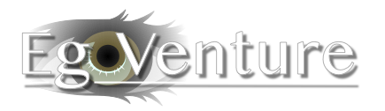

# First person point and click adventure framework for Godot

## Introduction

*EgoVenture* is a [Godot](https://godotengine.org) framework written in Gdscript for creating first person pont and click adventure games like [the Carol Reed games by MDNA games](https://mdna-games.com/) for mouse- and touch-based games.

Actually, this enigne was originally made by MDNA games together with deep entertainment and is used for the Carol Reed series since 2021.

It's streamlined for their games, but may be of use for other developers as well. Thus we're releasing it as Open Source under the [MIT license](LICENSE).

## Documentation

* [Getting started](docs/getting_started.md)

* [Basic structure](docs/structure.md)

* [The game state](docs/state.md)

* [Scenes and navigation](docs/scenes.md)

* [Inventory handling](docs/inventory.md)

* [Hotspots](docs/hotspots.md)

* [Effects, music and background sounds](docs/sound.md)

* [Game configuration](docs/configuration.md)

* [Hint system](docs/hints.md)

* [Theming](docs/theming.md)

* [API-Docs](docs/api)

## Development

If you find bugs or need more features, please [file an issue within this repository](https://github.com/deep-entertainment/egoventure/issues). 

As this framework is used internally at Mdna Games, we'll have to consider each new feature.

If a new feature doesn't match or contradicts our needs, we might refuse to accept it, but welcome you to fork this repository and implement it yourself.

You're welcomed to open pull requests about bugs or (confirmed) features any time and we'll review it and might ask you for modifications. Thank you for your work!
