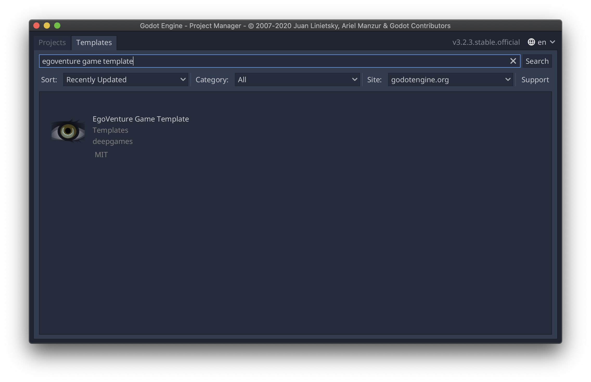
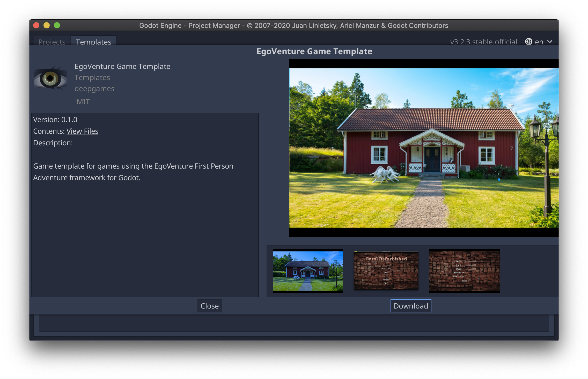
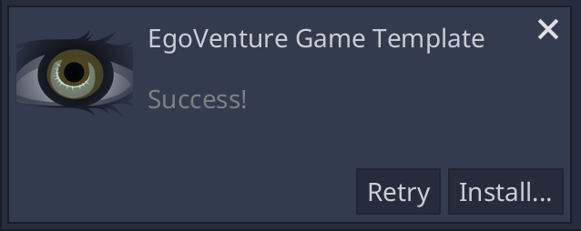
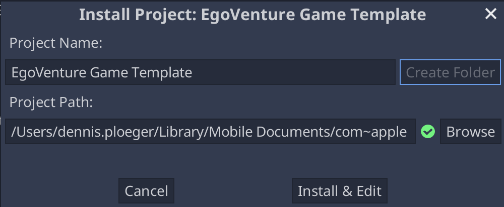
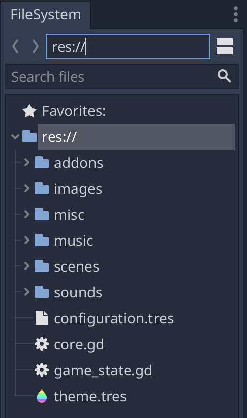
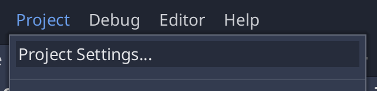
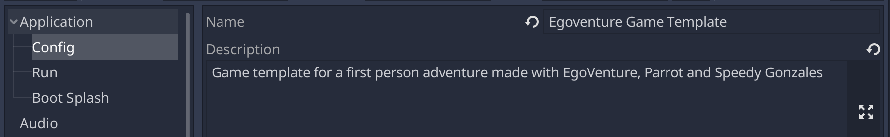
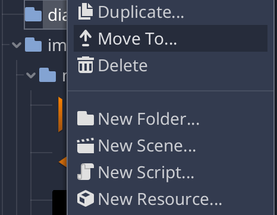
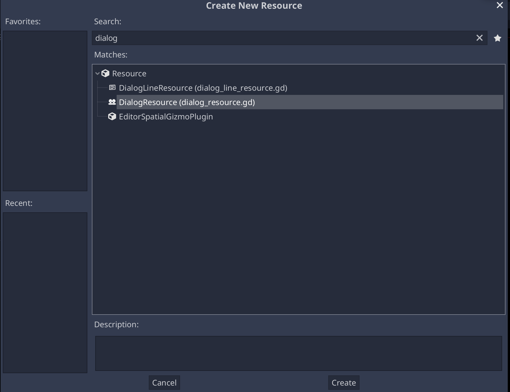

# Getting started

*EgoVenture* is a framework for creating first person point and click games. It handles and streamlines the most basic stuff and makes it easy to develop games like this.

Usually, the games need two more plugins to fully function:

* Speedy Gonzales - custom mouse cursor handling

* Parrot - voice dialog handling

To easily get started making an *EgoVenture* game, it's recommended to use the *EgoVenture Game Template*. This template includes all required plugins, a default game configuration, a basic game state and initialization code and the recommended folder structure to get you started right away.

## Create a new Project

Start the Godot editor, and search for the *EgoVenture Game Template* in the Templates tab:

Click on "EgoVenture Game Template".

Click on "Download" to download the game template to your computer. After finishing, click install:

Enter the name of your new game and the folder where it should be created:

Click on "Install & Edit" to start the editor. It will reimport the provided assets.

Now **<u>close the editor and reopen it</u>**. Godot seems to loose the links to the provided assets if you don't.

## Default folder structure

Afterwards check out the default folder structure of the game template:

* addons: Holds the compatible versions of *EgoVenture*, *Parrot* and *Speedy Gonzales*

* characters: Holds all dialog characters if you want to take advantage of *Parrot's* multi-character feature

* dialogs: Your game's *Parrot* dialogs

* inventory: The inventory items and their corresponding images

* images: Is the root folder for all visual resources in this project. Currently, there are two subfolders there:
  
  * misc: Holds various images like icons and button images
  
  * mouse: Holds the default mouse cursor images

* misc: Holds everything that doesn't match the other folders. Currently, it holds one subfolder:
  
  * fonts: The used fonts

* music: Holds all music items

* scenes: Holds all locations and their corresponding scenes. Map scenes for example can directly reside in "scenes", other scenes should be in a location subfolder. For more information check out the [scenes management documentation](scenes.md).

* sounds: Holds all background sounds and sound effects

* voices: The voice files of your *Parrot* dialogs

This folder structure is a recommendation for organizing the assets of the game, but you can obviously change it to your liking.

Additionally, these files reside in the root directory of the project:

* configuration.tres: The default [game configuration](configuration.md)

* core.gd: The core singleton for the game template, that controls the basic game logic. Check out the [structure documentation](structure.md) for details

* game_state.gd: An example [game state](state.md) 

* theme.tres: The default [game theme](theming.md)

* hints.txt (not visible in Godot): An example file for the [internal hints system](hints.md).

* project.godot (not visible in Godot): The project file of your new game

* Additional files like the README and license file from the game template (not visible in Godot). Those can safely be removed.

## Setting up

It's recommended to first set the game name in the project settings:

Additionally, you might want to check the game resolution. EgoVenture defaults to the QHD resolution of 2560 by 1440 pixels.

If you plan to use a smaller resolution, you need to change this setting.

Afterwards, check out the [game configuration](configuration.md) file configuration.tres and configure everything you need.

Also, check out the [default theme](theming.md) and change it to your liking. Check out the [Godot documentation about GUI skinning](https://docs.godotengine.org/en/stable/tutorials/gui/gui_skinning.html) for details of configuring a theme.

## Importing assets

Open the game folder in your operating system's file manager. There you will see the same folder structure as documented above, so you can directly copy game assets like images, music and sounds to their respective folders.

When you get back to Godot, it will import those assets into a standard format, so it can use it in all supported platforms. Check out the [Godot documentation about the import process](https://docs.godotengine.org/en/stable/getting_started/workflow/assets/import_process.html) for details.

## Designing scenes

Select "New Scene" from the "Scene" menu to create a new scene and use the provided Godot resources to build up your individual scenes. Check out the [scenes documentation](scenes.md) for additional information.

## Writing dialog

Select the dialogs folder and click on the right mouse button. Select "New Resource"

In the type selector, search for "DialogResource" and click "Create"

For more details on how this resource is filled, check out the [Parrot documentation about it](https://github.com/deep-entertainment/parrot/blob/main/docs/resources.md).

## Exporting

When you're ready with your game, refer to the [Godot export documentation](https://docs.godotengine.org/en/stable/getting_started/workflow/export/index.html) on how to export your game for the various supported platforms.

## Where to go from here

Now that you know the basics, check out the rest of the documentation. 

If anything goes wrong or you have questions, please join our Discord server for community support:

