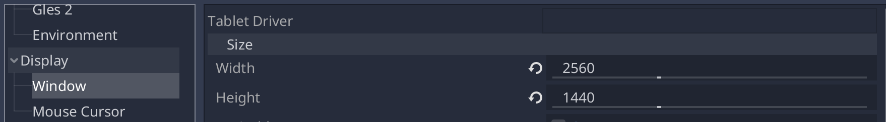
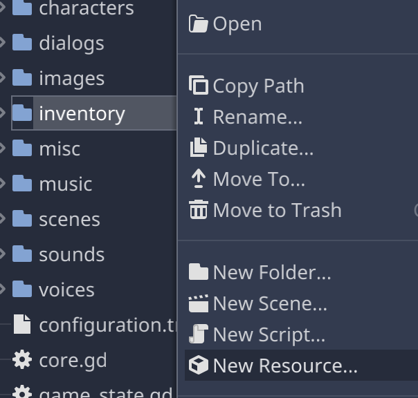

# Getting started

Hello and welcome to *EgoVenture*.

*EgoVenture* is a framework for creating first person point and click games. It handles and streamlines the most basic stuff and makes it easy to develop games like this.

The *EgoVenture* project provides different packages:

* The [*EgoVenture* example game](https://godotengine.org/asset-library/asset/906), which is made by MDNA games and showcases all features of *EgoVenture*. You can download the game and open it in Godot to check out, how things are done.
* The [*EgoVenture game template*](https://godotengine.org/asset-library/asset/905), which is used as a starting point for a new game, that bases on *EgoVenture*. This template includes all required plugins, a default game configuration, a basic game state and initialization code and the recommended folder structure to get you started right away.
* The individual Godot addons, that form the *EgoVenture* features:
  * The [*EgoVenture* core plugin](https://godotengine.org/asset-library/asset/903) which holds the basic features
  * [Speedy Gonzales](https://godotengine.org/asset-library/asset/904) for easy custom mouse cursor handling
  * [Parrot](https://godotengine.org/asset-library/asset/907) used for voice dialog handling

In the following sections we will guide you how to start creating your first game using the *EgoVenture* framework.

## Downloading Godot

Go over to https://godotengine.org/download and download the current stable version of the Godot engine for your operating system and install it.

## Create a new Project

Start Godot, and search for the *EgoVenture Game Template* in the Templates tab:

Click on "EgoVenture Game Template".

Click on "Download" to download the game template to your computer. After finishing, click install:

Enter the name of your new game and the folder where it should be created:

Click on "Install & Edit" to start the editor.

The *EgoVenture* game template includes a small set of assets (i.e. mouse cursor icons, a basic game configuration and theme) that help you getting started. After you've clicked on "Install & Edit", these assets are automatically processed by Godot.

After that process finished, **<u>close Godot and open it again</u>**. Godot seems to loose the links to the provided assets if you don't.

## Default folder structure

Afterwards check out the default folder structure of the game template:

* `addons`: Holds the compatible versions of the required addons *EgoVenture*, *Parrot* and *Speedy Gonzales*

* `characters`: Holds all dialog characters if you want to take advantage of *Parrot's* multi-character feature

* `dialogs`: Your game's *Parrot* dialogs

* `inventory`: The inventory items and their corresponding images

* `images`: Is the root folder for all visual resources in this project. Currently, there are two subfolders there:
  * `misc`: Holds various images like icons and button images
  
  * `mouse`: Holds the default mouse cursor images
  
* `misc`: Holds everything that doesn't match the other folders. Currently, it holds one subfolder:
  * `fonts`: The used fonts
  
* `music`: Holds all music items

* `scenes`: Holds all locations and their corresponding scenes. Map scenes for example can directly reside in "scenes", other scenes should be in a location subfolder. For more information check out the [scenes management documentation](scenes.md).

* `sounds`: Holds all background sounds and sound effects

* `voices`: The voice files of your *Parrot* dialogs

This folder structure is a recommendation for organizing the assets of the game, but you can obviously change it to your liking.

Additionally, these files reside in the root directory of the project:

* `configuration.tres`: The default [game configuration](configuration.md)

* `core.gd`: The core singleton for the game template, that controls the basic game logic. Check out the [structure documentation](structure.md) for details

* `game_state.gd`: An example [game state](state.md) 

* `theme.tres`: The default [game theme](theming.md)

* `hints.txt` (not visible in Godot): An example file for the [internal hints system](hints.md).

* `project.godot` (not visible in Godot): The project file of your new game

* Additional files like the `README` and license file from the game template (not visible in Godot). Those can safely be removed.

## Setting up

It's recommended to first set the game name in the project settings. Click on the *Project* menu, then on *Project Settings...*. On the left side, select the section *Config* under *Application* and change the *Name* and *Description* fields so they match your game. This way, you can easily identify your game in the project manager when you start Godot.

Additionally, you might want to check the game resolution in the *Window* section under *Display*. EgoVenture defaults to the QHD resolution of 2560 by 1440 pixels.

If you plan to use a smaller resolution, you need to change this setting.

Afterwards, find the [game configuration](configuration.md) file `configuration.tres` in the file explorer in the lower left corner, doubleclick it and configure everything you need using the "Inspector" on the right side of the screen. All available configuration options are documented in the [game configuration](configuration.md) page of this documentation.

Also, check out the [default theme](theming.md) by double clicking on the file `theme.tres` and change it to your liking. Check out the [theme documentation](theming.md) for details about configuring a theme and what things you can change in *EgoVenture*.

## Importing assets

Open the game folder in your operating system's file manager. There you will see the same folder structure as documented above, so you can directly copy game assets like images, music and sounds to their respective folders.

For scene images, it's recommended to group connected images of a specific area into *locations*, add a new folder under `images`for each location and put the images there.

When you get back to Godot, it will import those assets into a standard format, so they can be used in all supported platforms. Check out the [Godot documentation about the import process](https://docs.godotengine.org/en/stable/getting_started/workflow/assets/import_process.html) for details.

## Designing scenes

Select "New Scene" from the "Scene" menu to create a new scene. You can use all the provided Godot resource types to build up your specific scenes. *EgoVenture* has some special resources that aid you in creating the scenes for your game. For example, there is a special scene that supports four different images, each for one side and already includes features to switch around in this scenes.

### Setting up the scene

To use this, right-click the first node of the new scene, and select "Instance Child Scene".

Search for "four" and select "Four Side Room". Click on "Open"

This will add a new node to your scene, which is an *instance* (basically a copy) of the four side room scene.

Look into the inspector on the right side. Here you can configure four images that each represent one side of this scene and select a default view that will be shown when the player enters the scene.

To select an image, click on the arrow of the respective view and select *Load*.

Select the image from the file browser and a small preview will be shown. Set an image for each side then save the scene using *Save Scene* from the *Scene* menu:

Use a meaningful name, so that you can reference it later when the player walks through the rooms.

Now it's time to playtest this scene. Click on the *Play Scene* button on the upper right part of Godot:

If all went right, you should see the default view you configured earlier and can click on the left and right side of the screen to "turn around" in your scene.

So, turning around already works. Now we should allow the player to advance to the next scene. 

### Adding a hotspot

Right click on the top node of your scene again. This time, click on *Add Child Node*

Search for "WalkHotspot" and click on *Create*:

A `WalkHotspot` is a standardized way of creating clickable areas where the player can move to another scene. This will create a rectangle in the scene view, that you have to move and resize to match the area the player can click:

In the inspector you can configure the target scene by selecting it from the file browser. You can also select the view that should be shown when entering the new scene, another mouse cursor, if you don't want to show the *Go Forward* cursor and select a sound effect that is played when the user clicks on the area and can be used when opening doors for example:

Use this methods to move around in your game.

### Adding more interactivity

Now it get's a bit more complicated, as we will need to use Godot's scripting language *GDScript* for the more advanced things like handling inventory items or modifying your scenes.

In this example we will be adding a new inventory item to the inventory.

First, put three images for the new inventory item in the folder `inventory`:

* A normal image, that is shown in the inventory
* A highlighted image that is shown when the user selects the item and moves it over an area where it can be used
* A big image, that will be shown when the user right-clicks the item in the inventory

After that create a new inventory item resource by right clicking the folder `inventory`in the file browser. Select *New Resource*:

Search for *Inventory* and create a new `InventoryItem` resource:

Give the new resource file a meaningful name (e.g. `keys.tres`or `dog_whistle.tres`). In the inspector, set a title for your inventory item, a description that will be shown in the detail view and select the three images for the respective properties:

There are some more options here, but let's leave them for the moment.

Back to the scene. Right click the top node again and add a new child node. This time, select a Hotspot:

This time you only have to select a fitting mouse cursor for the hotspot (e.g. *Hand*)and move the rectangle somewhere in the scene where the player can "pick up" your inventory item by clicking on the area.

Now we need to add a new script for this scene. We will use Godot's own scripting language *GDScript* in this example. Select your top node using the left mouse button and use the *Attach Script* button to add a new script to your scene:

Enter the name of your new script. It's recommeded to give the script the same name as the scene (with the `.gd`extension)

This will directly open the script in the built-in script editor. For now, just use the *2d* button in the mode selection over the editor:

Godot scripting is done using a system of *signals*. Nodes can emit signals on various actions and scripts can "listen to" this signals and react to them.

Select the new hotspot and on the right side, switch from *Inspector* to *Node* to see the available signals. Double click on *activate*.

Enter a meaningful name for a new function, that will be created in the script of the scene and that will listen to the *activate* signal.

Usually, you can just accept the default and click on *Connect*. The script editor will be shown again and you're directly in the new function:

Now it comes to scripting, but don't be afraid. GDScript is very easy to understand and all the available functions of *EgoVenture* are well documented in the [API documentation](api).

To add a new item to the player's inventory, you need the [`Inventory`](api/Inventory.gd.md) class and specifically the `add_item` function. Also, you need the path to your inventory item.

Godot uses a so-called *virtual file system*, because the file systems of each platform, that Godot supports, differ in certain aspects. Paths in Godot always start with `res://` and the path to the specific resource after that. Each directory is separated using a forward slash /. So, for example, if you added the inventory item `keys.tres` in the `inventory` folder, the path would be:

`res://inventory/keys.tres`

To add this item to the player's inventory, remove the line `pass` from the script and replace it with:

`Inventory.add_item(preload("res://inventory/keys.tres"))`

Don't get confused by the `preload` function. That is used for *loading* the inventory item itself and giving it to the `add_item` function and is required in this case.

That's it. Start the scene again and click on the area. The inventory bar should show your new item.

## Where to go from here

Now that you know the basics, check out the rest of the documentation. 

If anything goes wrong or you have questions, please join our Discord server for community support:

