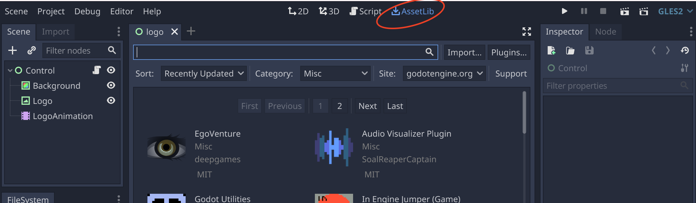
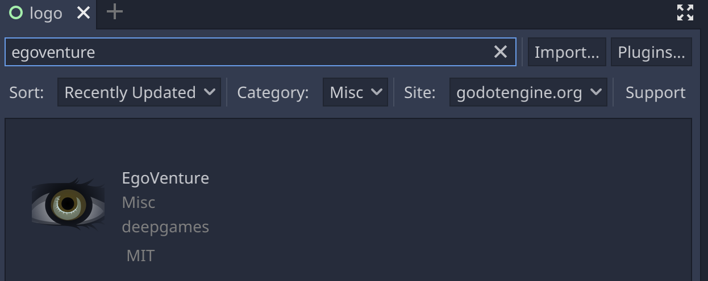
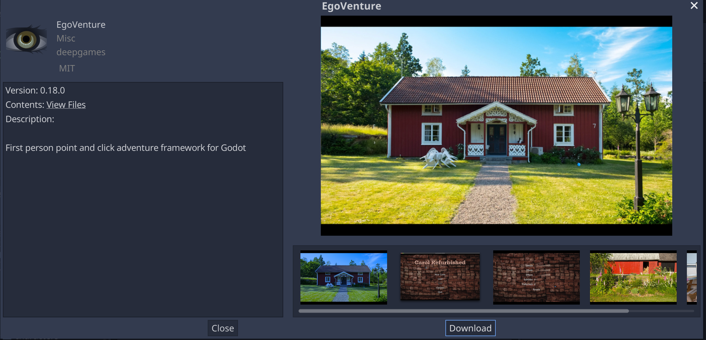
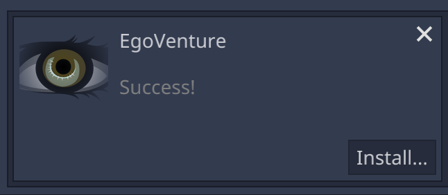
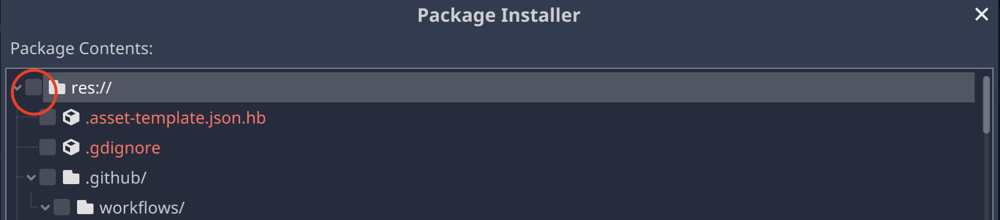
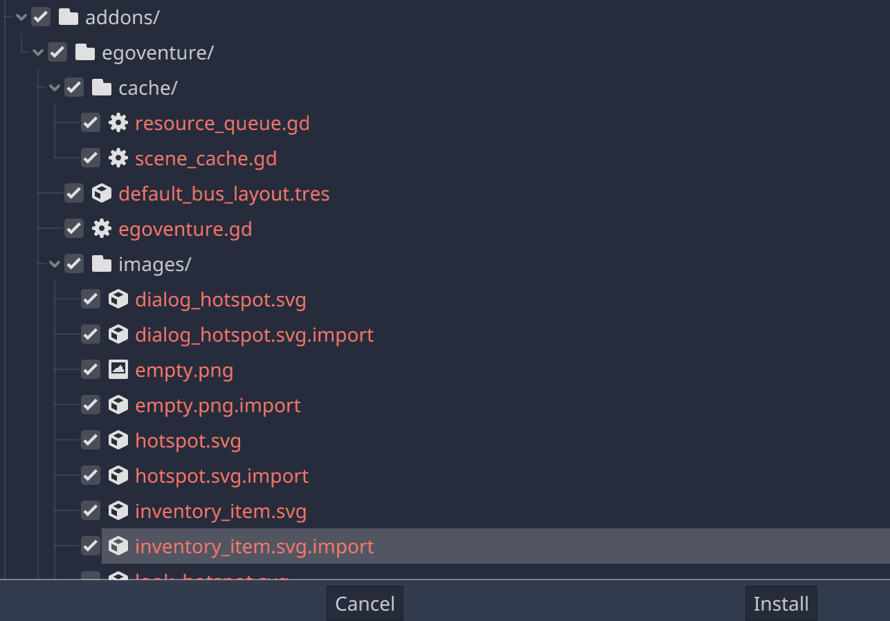

# Updating EgoVenture

The main EgoVenture functionality is distributed as Godot addons. Addons can be simply updated by downloading the new version and overwriting the existing files.

**Warning**: If you use EgoVenture, you should **never** change files inside the following folders to be able to update to newer versions:

* `addons/egoventure`
* `addons/parrot`
* `addons/speedy_gonzales`

To update, switch to the Godot AssetLib view:

Then, search for the addon you want to update (EgoVenture, Parrot or Speedy Gonzales):

Click on the name of the Addon (EgoVenture in this example) to see some information about it:

Check, that the given version is the one you'd like to update to (0.18.0 in this example). Click "Download". The addon will be downloaded now. Wait until it's finished:

Click "Install..." 

The next part is currently very cumbersome. First, remove the check mark at the topmost entry in the package installer:

Then select **every** folder and file inside the Addons' path (addons/egoventure in this example). This is because you the files already exists and Godot requires you to check all files that it should overwrite.

After that, click "Install" and the update will be installed.
